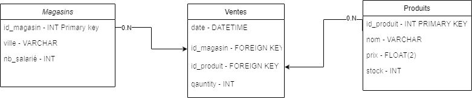

# BRIEF - Analyser les ventes d’une PME


## 1. Schéma de l'architecture - MCD



## 2. Schéma de la base de données

### 2.1 Description du schéma

Table "Ventes"
- Date (Date)
- ID Référence produit (VARCHAR)
- Quantité (INT)
- ID Magasin (INT)

*Relation avec la table "Produits" :*
 - ID Référence produit (Clé étrangère référençant Produits.ID Référence produit)
*Relation avec la table "Magasins" :*
 - ID Magasin (Clé étrangère référençant Magasins.ID Magasin)

Table "Produits"
- Nom (VARCHAR)
- ID Référence produit (VARCHAR, Clé primaire)
- Prix (FLOAT)
- Stock (INT)

Table "Magasins"
- ID Magasin (INT, Clé primaire)
- Ville (VARCHAR)
- Nombre de salariés (INT)

### 2.2 Création de la base de données et importation des données - SQL

```SQL
-- Création de la base de données (ne fonctionne pas avec SQLite)
CREATE DATABASE IF NOT EXISTS VentesDB;

-- Sélection de la base de données (ne fonctionne pas avec SQLite)
USE VentesDB;

-- Création de la table "Produits"
CREATE TABLE IF NOT EXISTS Produits (
    Nom VARCHAR(255),
    ID_Reference_produit VARCHAR(255) PRIMARY KEY,
    Prix FLOAT,
    Stock INT
);

-- Création de la table "Magasins"
CREATE TABLE IF NOT EXISTS Magasins (
    ID_Magasin INT PRIMARY KEY,
    Ville VARCHAR(255),
    Nombre_de_salarie INT
);

-- Création de la table "Ventes"
CREATE TABLE IF NOT EXISTS Ventes (
    Date DATE,
    ID_Reference_produit VARCHAR(255),
    Quantite INT,
    ID_Magasin INT,
    FOREIGN KEY (ID_Reference_produit) REFERENCES Produits (ID_Reference_produit),
    FOREIGN KEY (ID_Magasin) REFERENCES Magasins (ID_Magasin)
);

---------------------------------------------
-- Importation des données dans les tables --
---------------------------------------------

-- Insertion des données dans la table "Produits"
INSERT INTO Produits (Nom, ID_Reference_produit, Prix, Stock) VALUES
('Produit A', 'REF001', 49.99, 100),
('Produit B', 'REF002', 19.99, 50),
('Produit C', 'REF003', 29.99, 75),
('Produit D', 'REF004', 79.99, 120),
('Produit E', 'REF005', 39.99, 80);

-- Insertion des données dans la table "Magasins"
INSERT INTO Magasins (ID_Magasin, Ville, Nombre_de_salarie) VALUES
(1, 'Paris', 10),
(2, 'Marseille', 5),
(3, 'Lyon', 8),
(4, 'Bordeaux', 12),
(5, 'Lille', 6),
(6, 'Nantes', 7),
(7, 'Strasbourg', 9);

-- Insertion des données dans la table "Ventes"
INSERT INTO Ventes (Date, ID_Reference_produit, Quantite, ID_Magasin) VALUES
('2023-05-27', 'REF001', 5, 1),
('2023-05-28', 'REF002', 3, 2),
('2023-05-29', 'REF003', 2, 1),
('2023-05-30', 'REF004', 4, 3),
('2023-05-31', 'REF005', 7, 2),
('2023-06-01', 'REF001', 3, 4),
('2023-06-02', 'REF002', 6, 1),
('2023-06-03', 'REF003', 1, 5),
('2023-06-04', 'REF004', 2, 3),
('2023-06-05', 'REF005', 5, 6),
('2023-06-06', 'REF001', 4, 7),
('2023-06-07', 'REF002', 3, 2),
('2023-06-08', 'REF003', 6, 4),
('2023-06-09', 'REF004', 2, 1),
('2023-06-10', 'REF005', 8, 3),
('2023-06-11', 'REF001', 3, 2),
('2023-06-12', 'REF002', 5, 4),
('2023-06-13', 'REF003', 2, 5),
('2023-06-14', 'REF004', 4, 7),
('2023-06-15', 'REF005', 6, 6),
('2023-06-16', 'REF001', 3, 1),
('2023-06-17', 'REF002', 7, 2),
('2023-06-18', 'REF003', 2, 3),
('2023-06-19', 'REF004', 5, 4),
('2023-06-20', 'REF005', 4, 5),
('2023-06-21', 'REF001', 6, 6),
('2023-06-22', 'REF002', 3, 7),
('2023-06-23', 'REF003', 2, 1),
('2023-06-24', 'REF004', 4, 2),
('2023-06-25', 'REF005', 5, 3);

```

### 2.3 Première analyse des ventes avec SQL

```SQL
-- Requête pour obtenir la quantité totale de ventes par produit
SELECT 
    ID_Reference_produit,
    SUM(Quantite) AS Quantite_totale
FROM Ventes
GROUP BY ID_Reference_produit
ORDER BY Quantite_totale DESC;


```

### 2.4 Stockage des résultats des analyses

```SQL
-- Création de la table pour stocker les résultats des analyses
CREATE TABLE IF NOT EXISTS Resultats_Analyses (
    ID_Analyse INT PRIMARY KEY AUTO_INCREMENT,
    Description VARCHAR(255),
    Resultat VARCHAR(255),
    Date_Analyse TIMESTAMP DEFAULT CURRENT_TIMESTAMP
);

-- Exemple d'insertion de résultats
INSERT INTO Resultats_Analyses (Description, Resultat) VALUES 
('Analyse de ventes par produit', 'Quantité totale par produit calculée avec succès');
```

## Architecture du Système

| Service d'exécution des scripts (ScriptService) | Service de stockage de données (DatabaseService) |
|--------------------------------------------------|--------------------------------------------------|
| **Objectif :** Exécution de scripts.             | **Objectif :** Stockage des données.             |
|                                                  |                                                  |
| **Entrées :**                                    | **Entrées :**                                    |
| Port : 5000 (HTTP POST) - Pour recevoir des  requêtes POST avec les scripts à exécuter.      | Port : 5432 (JDBC/ODBC) - Pour recevoir des  données à stocker dans la base de données.     |
|     
| Sens : HTTP POST                                 | Sens : JDBC/ODBC                                 |
|                                                  |                                                  |
| **Sorties :**                                   | **Sorties :**                                   |
| Port : 5001 (HTTP GET) - Pour fournir des         | Pas de port de sortie direct, mais peut fournir |
| résultats ou des informations après l'exécution   | des accès aux données stockées sur demande      |
| des scripts.                                     | (par exemple, via des requêtes SQL).            |


## 3. Dockerfile pour le service d'exécution de scripts

```Dockerfile
# Utilisation d'une image de base avec l'environnement Python
FROM python:3.8

# Copie des scripts dans le conteneur
COPY classes /app/classes
COPY data /app/data
COPY hello-world.py /app/

# Définition du répertoire de travail
WORKDIR /app

# Exécution du script "hello-world" 
CMD ["python", "hello-world.py"]

```

### 2. Docker Compose

```docker
# monter une image docker avec le tag "briefdatainge"
docker build -t briefdatainge .
```
